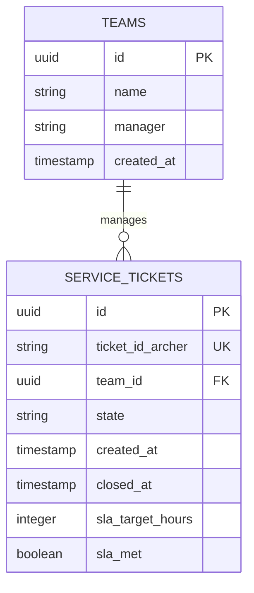

# Database Design & Modeling

This folder holds database architecture design, schema descriptions, relational structures, and migration strategies.

---

## Expected Content & Scope

- **ERD Diagrams**: Visual maps or Mermaid descriptions outlining relationships.
- **Data Dictionary**: Comprehensive tables detailing columns, types, keys, and nullability for every database table.
- **Indexing Guidelines**: Strategies for optimizing heavy analytical joins and aggregation queries.
- **Migrations Guide**: Instructions for executing database schema updates using Alembic.

---

## Database Design Conventions

1. **Naming Conventions**: Use `snake_case` for all table names, column names, indexes, and constraints. Table names should be plural (e.g., `service_tickets`, `teams`).
2. **Primary Keys**: Every table must have a primary key, preferably a UUID or an auto-incrementing BigInt.
3. **Audit Columns**: Every table holding transaction or dimension data must contain standard operational audit columns:
   - `created_at` (Timestamp with timezone, default `now()`)
   - `updated_at` (Timestamp with timezone, default `now()`, updated via trigger)
4. **Foreign Keys**: Explicitly define foreign key relationships. Avoid orphaned data.

---

## ERD Reference Example (Mermaid)

